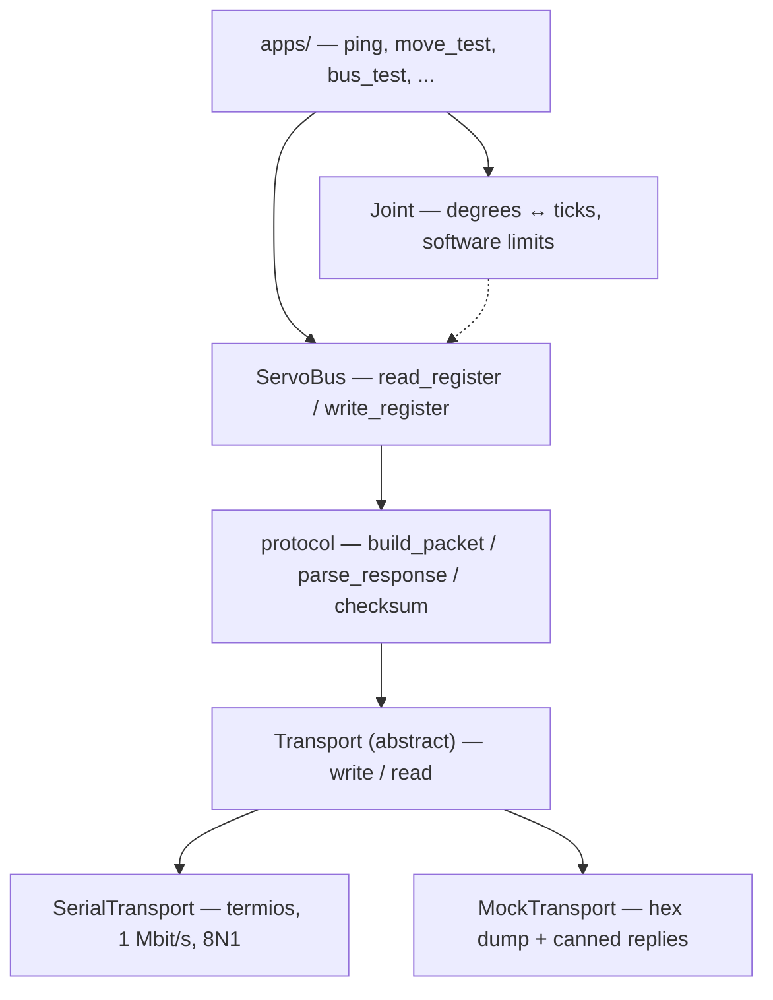

# robotarm

**C++ control software for a custom 5-DOF robotic arm, written from scratch — no vendor SDK.**


<!-- TODO: drop a photo or a short GIF of the arm here -->
<!--  -->

---

## What this is

A 5-servo robotic arm driven by Feetech STS3215 bus servos on a Raspberry Pi 5.
The mechanical design is a custom one. <!-- TODO: credit the designer here -->

The point of the project is the software. Feetech ships an SDK; this repository
deliberately does not use it. Every layer — serial port setup, packet framing,
checksums, register access, joint math — is implemented here, so that each byte
on the wire is something I can explain.

Mechanical brackets are designed in OpenSCAD (`cad/`) and printed on a Bambu Lab A1.

## Architecture

Each layer only talks to the one directly below it. The bottom is an abstract
interface, which is what makes everything above it testable without hardware.



`MockTransport` is not a testing afterthought: it prints the exact bytes a command
would put on the bus and returns a prepared answer. When a servo goes quiet, running
the same sequence against the mock says immediately whether the problem is in the
code or in the hardware.

The `Joint` layer is currently pure math (dashed arrow). The `Arm` layer that
coordinates several joints over one bus is the next piece.

## Wire protocol

Feetech servos speak a Dynamixel-style protocol over a half-duplex serial bus:

```
0xFF 0xFF   ID   LENGTH   INSTRUCTION   PARAM ...   CHECKSUM
```

* `LENGTH` = number of parameters + 2
* `CHECKSUM` = bitwise complement of the sum of all bytes from `ID` onwards
  (the two header bytes are not included)

Instructions used so far: `0x01` PING, `0x02` READ, `0x03` WRITE.

Register addresses and their widths live in
[`include/robotarm/registers.hpp`](include/robotarm/registers.hpp) as named
constants — `R_GOAL_POSITION` instead of `42`, with the width carried alongside
the address so the bus layer can reject a malformed write before it is sent.

## Hardware

| Part | Detail |
| --- | --- |
| Servos | 5× Feetech STS3215 (12 V, C018, 1:345), IDs 1–5 |
| Bus adapter | Waveshare Bus Servo Adapter A, USB mode → `/dev/ttyACM0` |
| Controller | Raspberry Pi 5 |
| Power | 12 V / 5 A, split into two feed branches instead of daisy-chaining all servos |
| Mechanics | Custom design, printed on a Bambu Lab A1 |

Power is fed in at two points on purpose: the JST connectors and traces on a servo
are not rated for the summed current of every servo behind it. From roughly the
third servo in a chain, the first connector becomes the bottleneck.

## Repository layout

```
robotarm/
├── include/robotarm/   # headers — what a class can do
├── src/                # implementation — how it does it
├── apps/               # small executables, one per experiment
├── cad/                # OpenSCAD models (servo library, fit test)
└── CMakeLists.txt
```

## Build and run

```bash
git clone https://github.com/knaakotto-tech/robotarm.git
cd robotarm
cmake -B build
cmake --build build
```

Targets that need no hardware — these run anywhere:

```bash
./build/mock_test        # dumps the bytes a command would send
./build/protocol_test    # checksum, packet building, joint math
./build/bus_test         # ServoBus against MockTransport
```

Targets that need a connected servo bus:

```bash
./build/ping             # ping servo ID 1
./build/move_test        # enable torque, drive to both ends, read position back
```

On Linux the user needs access to the serial device:

```bash
sudo usermod -aG dialout $USER   # then log out and back in once
```

On macOS use the `/dev/cu.*` device, never `/dev/tty.*` — the latter blocks on
open while waiting for a modem signal that never arrives.

## Status

- [x] `Transport` interface + `MockTransport`
- [x] `SerialTransport` (termios, 1 Mbit/s, raw mode, 100 ms read timeout)
- [x] Protocol layer — packet building, checksum, response parsing
- [x] Register map with address + width
- [x] `ServoBus` — read/write registers, verified against live servos
- [x] Joint layer — degree/tick conversion with software end stops
- [ ] Torque off on program exit
- [ ] Calibration tool to measure real zero positions
- [ ] `Arm` layer — several joints, synchronised writes
- [ ] Interpolation and kinematics
- [ ] Input layer (gamepad or web UI)

## Design notes

A few decisions that shaped the rest of the code:

* **Structured return types, not `bool`.** `read_register` returns a `Response`
  carrying id, error byte, payload and a validity flag; `degrees_to_ticks` returns
  a `TickResult`. The caller decides what to do with a failure — nothing is
  clamped silently and nothing throws.
* **Length checks before indexing.** In `parse_response`, the `size() < 6` guard
  has to come before comparing against the length byte, otherwise the subtraction
  wraps around on an unsigned type and a short reply passes as valid.
* **Software end stops live in the joint layer.** A joint driven past its
  mechanical limit works ~30 kg·cm against its own bracket. The limit check
  happens before a packet is ever built.
* **`ServoBus` holds a `Transport&`.** A bus without a transport is not a state
  worth representing, so the reference member makes it impossible to construct one.

## References

* Feetech STS3215 datasheet (ST-3215-C018) — register map and protocol
* Waveshare Bus Servo Adapter A documentation

## License

Licensed under the Apache License 2.0 — see [LICENSE](LICENSE).
